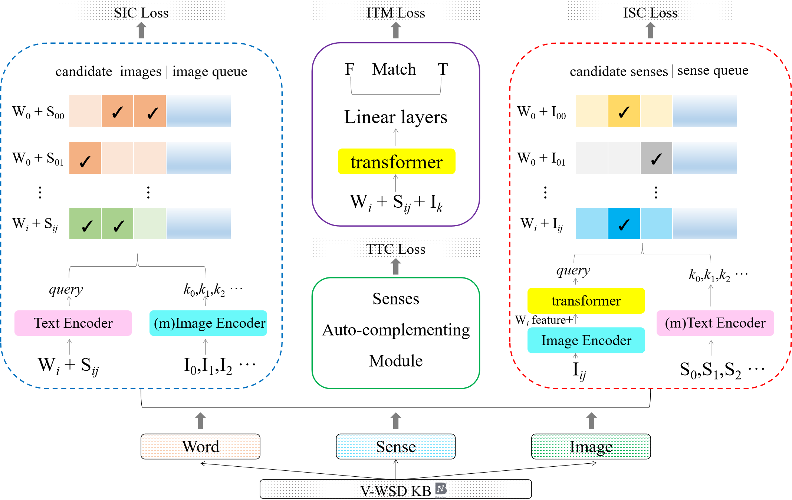
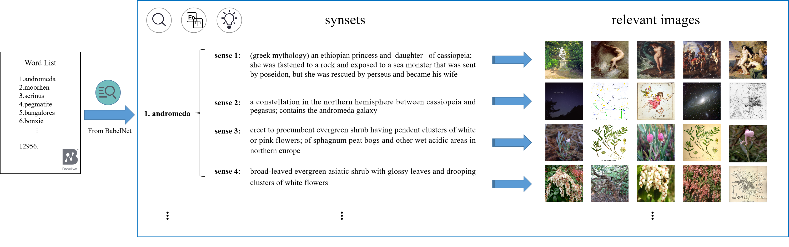

## FCLL: A Fine-grained Contrastive Language-Image Learning Model for Cross-language Visual Word Sense Disambiguation
Visual Word Sense Disambiguation (WSD), as a fine-grained image-text retrieval task, aims to identify the images that are relevant to ambiguous target words or phrases. However, the difficulties of limited contextual information and cross-linguistic background knowledge in processing text make this task challenging. To alleviate this issue, we propose a Fine-grained Contrastive Language-Image Learning (FCLL) model, which learns fine-grained image-text knowledge by employing a new fine-grained contrastive learning mechanism and enriches contextual information by establishing relationship between concepts and sentences. In addition, a multimodal-multilingual knowledge base involving ambiguous target words is constructed for visual WSD. Experiment results on the benchmark datasets from SemEval-2023 Task 1 show that our FCLL ranks at the first in overall evaluation with an average H@1 of 72.56% and an average MRR of 82.22%. The results demonstrate that FCLL is effective in inference on fine-grained language-vision knowledge. 

#### Approach:

#### 
#### V-WSD KB:

#### 
#### Announcement: Visual Word Sense Disambiguation (Visual WSD) is proposed by [SemEval-2023 Task 1](https://raganato.github.io/vwsd/) for the first time. Thanks to Raganato *et al.* for leading us to recognize this multimodal-multilingual field.

---

### Environment
Our code has been implemented on Pytorch 1.8.1. To reproduce our experiments, please run: <pre/>pip install -r requirements.txt</pre> 

### Usage
#### 1.Download the datasets: 
Please click on the following links to download the official training/test set and our V-WSD KB, and then create a new `. /data` folder in the project directory.

Dataset | Num. atw | Language of atw | Num. phrase | Language of phrase | Num. image | Correspondence | Size | Link
--- | :---: | :---: | :---: | :---: | :---: | :---: | :---: | :---:
Official training set | 12869 | EN | 12869 | EN | 12999 | 1-1-1 | 16.8GB | [Download](https://1drv.ms/u/s!AgvzREJAm7GyhEH4UfA4QFhhCM7E)
Official test set | 968 | EN, FA, IT | 968 | EN, FA, IT | 8100 | 1-1-1 | 10.4GB | [Download](https://1drv.ms/u/s!AgvzREJAm7GyhEBWWGyB5DkfT-fS)
V-WSD KB | 12956 | EN, FA, IT | 20904 | EN | 97267 | 1-n-n | 114GB | [Download]()

#### 2.Translate the non-English texts:
In the official test set, Non-English ambiguous target words and phrases should be translated into English text, stored in `fa_translation.txt` and `it_translation.txt` separately, as the following format ('\t' is uesd as the delimiter):

```
(an instance in Farsi)
برنج‎	brass	فلز برنج	brass
(an instance in Italian)
gomma	eraser	gomma per smacchiare	eraser for stain removal
```

Note that after downloading and translating, please place the above files as follows:<br>
```.
(the folder tree)
|—— FCLL
|    |—— data
|         |—— kb.data
|              |—— ...
|         |—— official.traindata
|              |—— ...
|         |—— official.testdata
|              |—— ...
|         |—— fa_translation.txt
|         |—— it_translation.txt
|    |—— CLIP
|    |—— ...
```

#### 3.To train from the scratch, please run:
```.
python main.py --train_batch_size 2 --num_workers 4
```
In training, the checkpoint of the best model will be saved into `./save_model`, the log of the training process will be saved into `./log`, and the outputs of each epoch will be saved into `./result`.

#### 4.To evaluate using the best checkpoint, please run:
```.
python main.py --eval_batch_size 16 --use_checkpoint --evaluate 
```
---

### Acknowledgement
FCLL is inspired by [CLIP](https://github.com/openai/CLIP) and [MoCo](https://github.com/facebookresearch/moco), simultaneously relies on resources from [BLIP](https://github.com/salesforce/BLIP) and [BabelNet](https://babelnet.org/). The original authors and their open-sourcing are appreciated.
